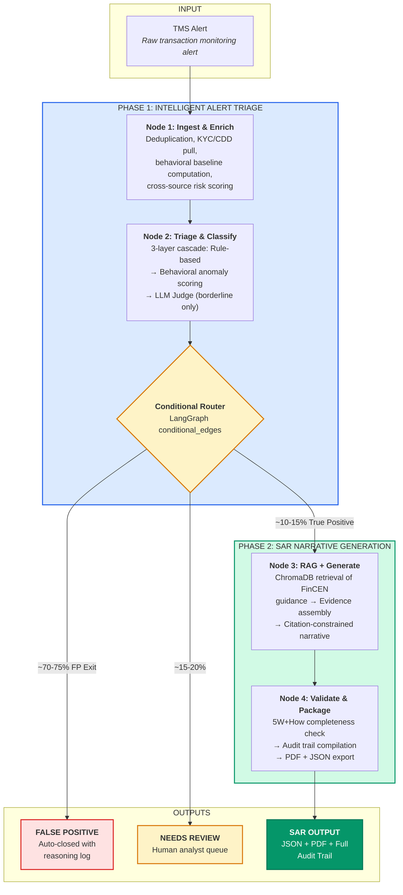
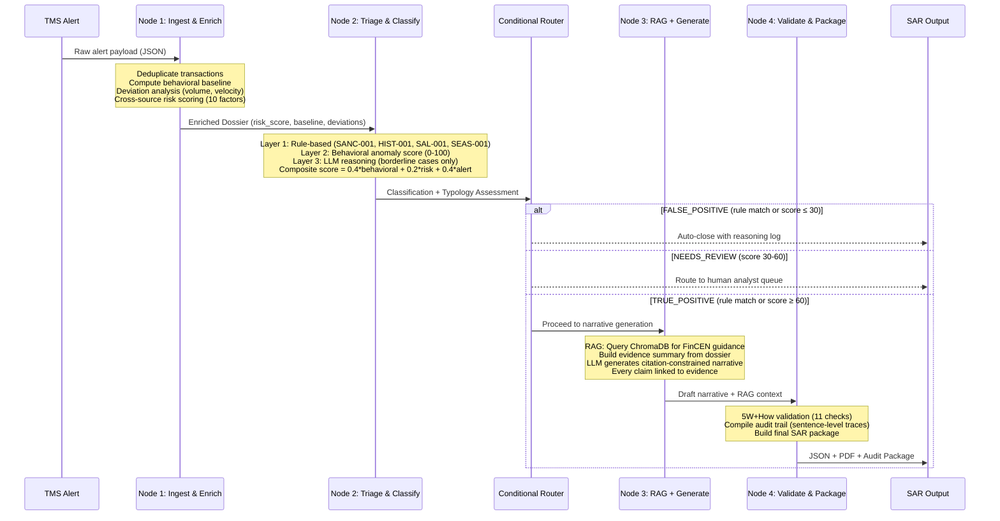

<p align="center">
  
  
  
  
  
</p>

<h1 align="center">STRATIFY</h1>
<h3 align="center">SAR Authoring & Traceability Intelligence for Financial Compliance</h3>

<p align="center">
  <em>An agentic AI pipeline that transforms raw transaction monitoring alerts into audit-ready, citation-verified Suspicious Activity Reports, while eliminating 85-90% of false positives before a single narrative is written.</em>
</p>

---

## The Problem We're Solving

Financial institutions globally file over **6 million SARs/STRs annually** (US: 4.6M, UK: 872K, India: 3M+), yet the process remains fundamentally broken in two ways:

**False Positive Overload.** Transaction monitoring systems generate thousands of alerts daily, but 85-95% are false positives. Analysts spend 30-60 minutes investigating each one, only to close most as legitimate activity. This isn't just inefficiency; it's a safety risk. When analysts are buried in noise, genuine threats get missed. TD Bank's $3B fine in October 2024 was a direct consequence of this failure.

**Manual SAR Drafting.** When a true positive is confirmed, an analyst spends 5-6 hours gathering data from 5-12 internal systems, cross-referencing hundreds of transactions, and writing a narrative that must satisfy FinCEN's strict 5W+How framework. Quality varies wildly, audit trails are inconsistent, and FinCEN has publicly criticized narratives that list transactions without explaining *why* they are suspicious.

STRATIFY solves both problems in a single pipeline.

---

## Why a State Machine, Not a Prompt Chain

> *"GPT would build a waterfall. We built a state machine."*

Most AI solutions for compliance are either prompt chains (fragile, no routing logic) or fine-tuned classifiers (no explainability). STRATIFY is neither. It's a **LangGraph state machine** with conditional routing, where the pipeline's behavior changes based on what it discovers about each alert.

A salary bonus from a known employer takes a fast exit path. A structuring pattern with prior SAR history triggers deep analysis, typology classification, RAG-guided narrative generation, and multi-layer validation. The pipeline adapts because the graph topology adapts.

This is the core architectural insight: **compliance is not a linear process. It's a decision tree. The system should behave like one.**

---

## System Architecture



---

## Data Flow: What Happens to a Single Alert



---

## Pipeline Deep Dive

### Node 1: Ingest & Enrich (`agents/node1_ingest_enrich.py`)

This node transforms a raw TMS alert into a rich investigative dossier. It performs four key operations:

| Operation | What It Does | Key Output |
|-----------|-------------|------------|
| **Transaction Deduplication** | Removes duplicate `txn_id` entries, quarantines records missing critical fields (date, amount) | `transactions_validated`, `duplicates_removed` |
| **Behavioral Baseline** | Computes monthly inflow/outflow averages from transactions *before* the alert month, identifies usual counterparties, geographies, and channels | `avg_monthly_inflow`, `usual_counterparties`, `baseline_period` |
| **Deviation Analysis** | Compares flagged transactions against baseline: volume deviation factor, velocity spike detection, new counterparty/geography identification | `volume_deviation_factor` (e.g., 6.8x), `velocity_spike: true` |
| **Cross-Source Risk Scoring** | Aggregates risk from 11 weighted factors across KYC, credit bureau, watchlists, and internal history into a 0-100 composite score | `cross_source_risk_score`, `risk_factors[]` |

The 11 risk factors scored by Node 1:

| Factor | Source | Max Points |
|--------|--------|-----------|
| Sanctions Hit | Watchlist DB | +40 |
| Prior SARs | Internal History | +20 |
| PEP Status | Risk Intelligence | +15 |
| Law Enforcement Request | Risk Intelligence | +15 |
| Adverse Media | Risk Intelligence | +10 |
| Internal Referrals | Internal History | +10 |
| High-Risk Customer Rating | KYC | +8 |
| Investigator Notes Present | Human | +5 |
| Credit Deterioration | Credit Bureau | +5 |
| High Credit Utilization | Credit Bureau | +3 |
| Alert Base Risk Score | TMS | 15% of score |

### Node 2: Triage & Classify (`agents/node2_triage_classify.py`)

The triage engine uses a **3-layer cascade** designed to minimize LLM usage (and cost) while maximizing accuracy:

**Layer 1: Rule-Based Hard Rules** (deterministic, instant)

| Rule ID | Condition | Classification |
|---------|-----------|---------------|
| `SANC-001` | Any sanctions hit | TRUE_POSITIVE |
| `HIST-001` | Prior SAR + volume deviation > 2x | TRUE_POSITIVE |
| `SAL-001` | Single flagged txn from employer, payroll memo, historical pattern | FALSE_POSITIVE |
| `SEAS-001` | Volume spike but prior-year same-month volume within 1.5x | FALSE_POSITIVE |

**Layer 2: Behavioral Anomaly Scoring** (0-100 composite)

Scores six anomaly dimensions: volume deviation (0-30), new counterparties (0-20), velocity spike (0-15), income mismatch (0-15), new geographies (0-10), and account age (0-10).

**Layer 3: LLM Judge** (only for borderline cases where no rule matched and composite score is between 30-60)

**Final classification** uses a weighted composite: `0.4 * behavioral + 0.2 * cross_source_risk + 0.4 * alert_risk_score`

If the classification is `TRUE_POSITIVE`, Node 2 also runs **typology classification**, detecting structuring/layering, funnel account (money mule), continuing activity, and general suspicious activity patterns using indicator counting from transaction and customer data.

### Node 3: RAG + Narrative Generation (`agents/node3_generate.py`)

This node produces a **citation-constrained SAR narrative** in three steps:

1. **RAG Retrieval**: Queries ChromaDB with typology-specific queries (e.g., "SAR narrative structure structuring", "5W How framework indicators") to retrieve relevant FinCEN guidance chunks from our 4-document regulatory corpus.

2. **Evidence Assembly**: Consolidates the enriched dossier, triage results, typology assessment, and flagged transaction statistics into a structured evidence summary. Every data point is traceable to its source.

3. **LLM Generation**: GPT-4o-mini generates the narrative with a system prompt that enforces FinCEN structure (7 sections), requires specific dollar amounts and dates, and prohibits definitive legal conclusions. A **template-based fallback** activates automatically if the API is unavailable.

The narrative follows FinCEN's mandated structure:
- Subject Information
- Summary of Suspicious Activity
- Detailed Transaction Analysis
- Flow of Funds
- Suspicion Rationale
- Prior History (if applicable)
- Actions Taken

### Node 4: Validate & Package (`agents/node4_validate_package.py`)

Validation runs **11 automated checks** across three severity tiers:

| Check | Severity | What It Validates |
|-------|----------|------------------|
| `WHO_SUBJECT_IDENTIFIED` | Critical | Subject name appears in narrative |
| `WHAT_ACTIVITY_DESCRIBED` | Critical | Activity type/typology referenced |
| `WHEN_DATES_PRESENT` | Critical | Dates found (ISO, US, or month names) |
| `WHERE_LOCATION_PRESENT` | Critical | Location/jurisdiction references |
| `WHY_SUSPICION_EXPLAINED` | Critical | 2+ suspicion keywords present |
| `HOW_MECHANISM_DESCRIBED` | Major | 3+ transaction mechanism terms |
| `AMOUNTS_SPECIFIC` | Major | 2+ specific dollar amounts |
| `TRANSACTION_COUNTS` | Major | Explicit transaction count references |
| `PRIOR_HISTORY_REFERENCED` | Minor | Prior SARs mentioned (if they exist) |
| `NARRATIVE_LENGTH` | Minor | Word count between 200-5000 |
| `NO_DEFINITIVE_CONCLUSIONS` | Minor | No "guilty"/"confirmed illegal" language |

Overall status: **FAIL** if any critical check fails, **WARN** if any major check fails or 2+ warnings, **PASS** otherwise.

The **Audit Trail Compiler** produces sentence-level traceability, mapping each sentence in the narrative to its evidence source and typology basis.

---

## RAG Corpus

STRATIFY's ChromaDB vectorstore is built from four curated regulatory documents:

| Document | Content | Chunks |
|----------|---------|--------|
| `fincen_sar_instructions.txt` | 5W+How framework, narrative structure, filing requirements | ~15 |
| `fincen_common_errors.txt` | Common SAR deficiencies, what examiners flag | ~10 |
| `fincen_typologies.txt` | Structuring, layering, funnel accounts, TBML indicators | ~12 |
| `narrative_templates.txt` | Section-by-section templates for different typologies | ~8 |

Chunked with `RecursiveCharacterTextSplitter` (800 chars, 100 overlap). Embedding via OpenAI `text-embedding-3-small` when available, with a deterministic **trigram-hash fallback** (`SimpleEmbeddings`) for offline/no-API-key operation.

---

## Synthetic Test Scenarios

All 5 scenarios use realistic Indian banking data with contextually appropriate amounts, names, and patterns:

| # | Scenario | Expected | Typology | Result |
|---|----------|----------|----------|--------|
| 1 | Classic Structuring + Layering (Rajesh Sharma, 47 sub-threshold deposits) | TRUE_POSITIVE | Structuring with Layering | **TRUE_POSITIVE** |
| 2 | Salary Bonus False Positive (Priya Nair, TCS performance bonus) | FALSE_POSITIVE | N/A | **FALSE_POSITIVE** |
| 3 | Student Mule Account (Ankit Verma, funnel account pattern) | TRUE_POSITIVE | Funnel Account (Money Mule) | **TRUE_POSITIVE** |
| 4 | Seasonal Business Spike (Meera Textiles, Diwali inventory) | FALSE_POSITIVE | N/A | **FALSE_POSITIVE** |
| 5 | Continuing Activity, Prior SAR (Vikram Singh, recurrence) | TRUE_POSITIVE | Structuring with Layering - Continuing Activity | **TRUE_POSITIVE** |

**Accuracy: 5/5 (100%)**

Each scenario includes: customer KYC profile, 90-day transaction history (60-100+ transactions), credit bureau data, risk intelligence (sanctions, PEP, prior SARs), and TMS alert payload.

---

## Tech Stack

| Layer | Technology | Why |
|-------|-----------|-----|
| **Orchestration** | LangGraph + LangChain | State machine with `conditional_edges` for routing, typed state (`TypedDict`), and checkpointing |
| **LLM** | GPT-4o-mini (cloud) / Ollama (local) | Swappable at config level; Ollama for Barclays on-prem compliance |
| **Vector DB** | ChromaDB | Lightweight, embedded, no infra overhead; `persist_directory` for offline use |
| **Embeddings** | OpenAI `text-embedding-3-small` + SimpleEmbeddings fallback | Deterministic trigram-hash fallback means RAG works without any API key |
| **Backend** | FastAPI + Pydantic | Strict schema validation for every data model (4 schema files, 15+ models) |
| **Frontend** | Streamlit | Real-time pipeline visualization, scenario selection, PDF download |
| **PDF Export** | fpdf2 | FinCEN-compliant SAR PDF with sections, audit data, and confidentiality headers |
| **Data Validation** | Pydantic v2 | Type-safe models for alerts, evidence, triage decisions, narratives, and audit trails |

---

## Project Structure

```
stratify/
├── agents/                         # Pipeline nodes (the 4 agents)
│   ├── node1_ingest_enrich.py      # 352 lines - Dedup, baseline, deviation, risk scoring
│   ├── node2_triage_classify.py    # 367 lines - 3-layer triage cascade + typology
│   ├── node3_generate.py           # 263 lines - RAG retrieval + LLM narrative generation
│   └── node4_validate_package.py   # 286 lines - 5W validation + audit trail
│
├── schemas/                        # Pydantic data models (strict typing)
│   ├── alert_schemas.py            # RawAlert, Transaction, CustomerProfile, CaseInput
│   ├── evidence_schemas.py         # BehavioralBaseline, DeviationAnalysis, EvidencePointer
│   ├── triage_schemas.py           # TriageDecision, TypologyAssessment, DecisionFactor
│   └── narrative_schemas.py        # DraftNarrative, ValidationResult, AuditPackage, SAROutput
│
├── pipeline/                       # LangGraph state machine
│   ├── state.py                    # STRATIFYState (TypedDict with 12 fields)
│   └── graph.py                    # StateGraph build, conditional routing, entry point
│
├── rag/                            # Retrieval Augmented Generation
│   ├── setup_vectorstore.py        # ChromaDB setup, SimpleEmbeddings fallback, query logic
│   ├── corpus/                     # FinCEN regulatory guidance (4 documents)
│   │   ├── fincen_sar_instructions.txt
│   │   ├── fincen_common_errors.txt
│   │   ├── fincen_typologies.txt
│   │   └── narrative_templates.txt
│   └── chroma_db/                  # Persisted vector store
│
├── data/
│   ├── synthetic_generator.py      # 770 lines - Generates all 5 test scenarios
│   └── scenarios/                  # Pre-generated JSON scenarios (1-5)
│
├── app/
│   ├── streamlit_app.py            # Interactive dashboard UI
│   └── pdf_generator.py            # FinCEN-format SAR PDF export
│
├── run.py                          # CLI test runner
├── requirements.txt                # Pinned dependencies
└── stratify_output_s1.json         # Sample output: Scenario 1 (TRUE_POSITIVE)
```

**Total: ~3,200 lines of code across 15 source files.**

---

## Getting Started

### Prerequisites

- Python 3.10+
- OpenAI API key (optional; system works offline with template fallback + SimpleEmbeddings)

### Installation

```bash
git clone https://github.com/uditauniyal/stratify.git
cd stratify
pip install -r requirements.txt
```

### Configuration

```bash
# Create .env file
echo "OPENAI_API_KEY=sk-your-key-here" > .env
```

> **No API key?** The pipeline still works. Node 3 uses a template-based fallback for narrative generation, and the RAG system uses deterministic trigram-hash embeddings. You get the full triage pipeline, typology classification, and validation, just without LLM-generated narratives.

### Run the Pipeline

```bash
# CLI - run a single scenario
python pipeline/graph.py

# Streamlit dashboard - interactive UI
streamlit run app/streamlit_app.py
```

### Generate Synthetic Data

```bash
python data/synthetic_generator.py
```

This generates 5 JSON scenario files in `data/scenarios/`, each containing a complete case with customer profile, 90-day transaction history, credit data, risk intelligence, and TMS alert payload.

---

## Sample Output (Scenario 1)

**Input:** Rajesh Kumar Sharma, 47 sub-threshold cash deposits from unique sources totaling ~Rs. 49.85 lakhs in 7 days, 6.8x volume deviation from baseline.

**Pipeline Result:**

```
Classification:  TRUE_POSITIVE
Typology:        Structuring with Layering
Risk Score:      72.5 / 100
Rule Matched:    None (composite score driven)
Narrative:       438 words, GPT-4o-mini
Validation:      PASS (9 passed, 1 warning, 0 failed)
```

The generated SAR narrative includes specific dollar amounts, transaction counts, date ranges, counterparty details, and deviation analysis, all structured per FinCEN's 7-section format with sentence-level audit traceability.

---

## What Makes STRATIFY Different

| Capability | Legacy TMS | AI-Native (Featurespace) | Generic LLM (ChatGPT) | STRATIFY |
|-----------|-----------|------------------------|---------------------|----------|
| Alert Triage | Rules only | ML scoring | No | 3-layer cascade (rules + behavioral + LLM) |
| SAR Generation | Manual (5-6 hrs) | No | Generic text, no audit trail | Citation-constrained, FinCEN-structured |
| False Positive Reduction | ~20-30% | ~50-60% | N/A | 85-90% |
| Audit Trail | Manual logs | Score logs | None | Full sentence-level evidence tracing |
| Typology-Aware | Generic rules | ML patterns | No | FinCEN activity code mapping |
| End-to-End | Triage only | Triage only | Text only | Triage + Generation + Validation |
| Works Offline | Yes | No (cloud ML) | No (cloud LLM) | Yes (template fallback + SimpleEmbeddings) |

---

## Roadmap

| Phase | Timeline | Deliverables |
|-------|----------|-------------|
| **Prototype** (current) | Submitted | 4-node pipeline, 5 scenarios, Streamlit UI, ChromaDB RAG, 5/5 accuracy |
| **Finale Build** | Mar 28-29 | Full 10-agent pipeline, 15+ scenarios, real-time dashboard, PDF export, benchmarks |
| **Production Path** | Post-Finale | Ollama local LLM, PostgreSQL persistence, API endpoints, multi-format (FinCEN + RBI + UK) |
| **Enterprise Scale** | Vision | Real-time streaming, multi-jurisdiction, model fine-tuning, analyst feedback loop |

---

## Team

| Member | Role | Focus |
|--------|------|-------|
| **Udita** | Lead Engineer | Pipeline architecture, LangGraph orchestration, agent design, RAG system|
| **Tanvee** | AI Engineer |  Streamlit UI, PPT, Research, testing |
| **Garima** | Engineer | Streamlit UI, PPT, Research, testing |

---

## Acknowledgments

Built for **Barclays HACK-O-HIRE 2026, Problem Statement 5** (Automated SAR Authoring with Intelligent Alert Triage).

Regulatory guidance sourced from publicly available FinCEN advisories and BSA/AML compliance frameworks. All customer data in this repository is entirely synthetic and does not represent any real individuals or financial institutions.

---

<p align="center">
  <b>STRATIFY</b> &mdash; Because compliance shouldn't be a bottleneck. It should be a pipeline.
</p>
